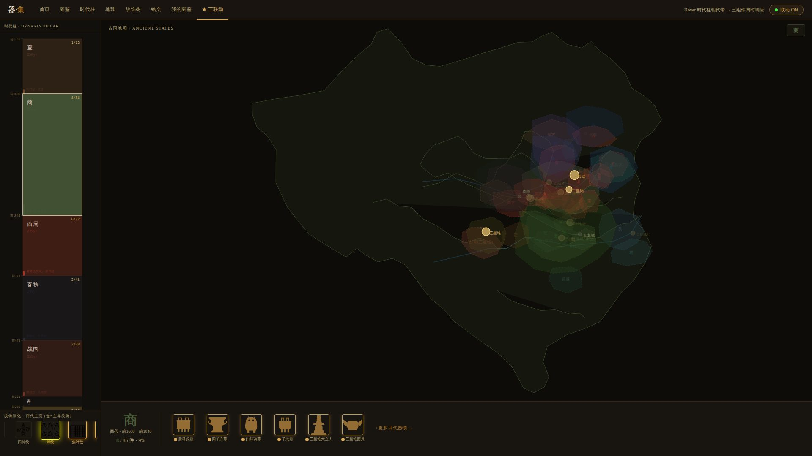

# MuseumCollect — AI PM 作品集

> 我用 8 个有边界的 AI agent 跑了 5 个 sprint,产出 1 个 converged demo + 11 份多视角 audit + 2 轮 audit-as-iteration-trigger 兑现,~9000 汉字 case-study,加 3 份 commercial PM artifact(NSM / 竞品矩阵 / 投资人 1-pager),以及一份 in-sandbox 真跑的 AI baseline。
> 这不是 "我用 AI 写代码的 PM",是 **"我把 AI 的约束当作产品设计原则"** 的实证。

[](demos/v3-converged/dashboard.html)

*↑ `demos/v3-converged/dashboard.html` — v3 三联动 wow demo,hover 时代柱 → 古国地图 + 纹饰行 + 文物卡片同步*

---

## 这是什么

一个 AI 产品经理的作品集项目。垂类是**中国青铜器图鉴 + 拍照识别 + 个人收藏**(类比文博版的 eBird / Pokédex)。重点不在产品本身有多完整 —— 它**不是 finished product**(MVP 没上线、AI 服务没真接、用户没测过);重点在**整个工程的开发过程**展示了一个 AI PM 应该会的能力:

1. **方法论可被外部 reviewer 用 grep 验证** — 每条 claim 都有对应文件
2. **多视角 audit 真闭环** — 不是"做完让人 review",audit 写完同时产出 next-iteration-brief,直接驱动下一轮 agent spawn
3. **量化的 cost-aware routing** — Opus / Sonnet 按 role 分配,$40-50 USD 全程
4. **诚实的 trade-off 记录** — 包括 §5.9 "为什么 ship production-shaped code 而不是 fake 数字"

## 30 秒看完

打开 [`index.html`](index.html) 在浏览器里。看到 hero 截图 + sprint timeline + main demo CTA + 量化 stats + 过程文档链接。

或者直接看一张 dashboard 三联动截图(上面 ↑)、读 [`docs/case-study.md` §0](docs/case-study.md#0-一句话-logline) 一句话 logline、扫 [morning-report TL;DR](morning-report.md#tldr)。

## 推荐阅读顺序

| 时间 | 文件 | 你会拿到 |
|---|---|---|
| 30 秒 | `index.html` | 项目全景 + 5 张 hero 截图 + 量化 stats |
| 5 分钟 | `morning-report.md` | D0 night-run 战果(3 demo + 6 audit + close-loop)|
| 25 分钟 | `docs/case-study.md` v0.8 | **核心文档** — Problem → Insight → Approach → Outcomes → Reflection → Commercial Gap,9000 汉字 6 节 |
| 8 分钟 | `docs/one-pager.md` ★ NEW | 投资人/CEO 90 秒版本 — Problem/Solution/Market/GTM/Ask 完整 |
| 12 分钟 | `docs/north-star.md` ★ NEW | NSM (WAC) + 2 层 metric tree + 6/12/24 月 target + 反指标 |
| 15 分钟 | `docs/competitive-landscape.md` ★ NEW | 8 个具名竞品 × 4 维矩阵 + moat 假设 + "为什么 X 不会做这个" |
| 12 分钟 | `docs/product-policy-and-risks.md` ★ NEW | 8 行 risk × Sev × Prob × mitigation + 4 product policy framework(AI 输出可信度 / UGC moderation / 隐私分层 / 删号)|
| 10 分钟 | `docs/analytics-event-taxonomy.md` ★ NEW | 11 V1 必埋 events × 5 类 + SQL 算 NSM/D7/W2 + scan_id join 算 in-the-wild P@5 |
| 15 分钟 | `docs/agent-team-design.md` | 6+1 audit + 8 role 拓扑 + Mermaid 图 + cost routing |
| 想看实证 | `audits/iteration-1-changes.md` / `iteration-2-v3-changes.md` | audit → 闭环兑现 cite-trail |
| 想看运行时 | `audits/d3-runtime.md` + `audits/d3-runtime.json` | v4.5 Runtime Auditor 16-case 真测 |
| 想看 AI 立场 | `docs/ai-roadmap.md` + `ai-service/poc/` | Phase 1-3 路线 + CLIP stub + pHash baseline 真数字 P@5=0.667 |
| 想看成本 | `cost/cost-report.md` | 15 agent × 真 token 数 + 估算 $20-25 |

## 5 个 Sprint 概览

```
v1 (D0, 2026-05-20 night)  3 differentiated demo (考据/沉浸/探索) + 5+1 视角 audit + v2 close-loop (12 SVG + 4 P0 fix)
v3 (D1, 2026-05-21 night)  7+1 维度收敛 + 277 件 11 字段 (5 DE 并行) + 12 页 v3-converged + event bus 协议
v4.5  (2026-05-22)          第 7 视角 Runtime Auditor 加入 · Playwright + axe-core + 16/16 test green · BUG-002/003/004 fix
v4.6  (2026-05-22)          真实 GeoJSON (d3.geoConicEqualArea) + mobile retrofit · 28/28 test green
v5    (2026-05-22→)         Tailwind CDN 卸载 (13 页) · a11y contrast · data-loader 并行化 · GeoJSON docs reconciliation
v0.6  (2026-06-05)          case-study §0.5 + §5.9 + AI PoC stub (ai-service/poc/) + portfolio index/README polish
v0.7  (2026-06-05)          §5.9.1 in-sandbox pHash baseline + 真 P@5=0.667 数字
v0.8  (2026-06-05 ★ now)    cold-audit response — 3 P0 docs (NSM / competitive / one-pager) + case-study §6 commercial gap (9000 汉字)
```

详细日志见 [`state/state.md`](state/state.md)(append-only event log,顶部有 executive summary)。

## Repo Map

```
prac03_MuseumCollect/
├── index.html                    # 作品集入口(打开即看)
├── morning-report.md             # D0 night-run 5-min TL;DR
├── docs/
│   ├── case-study.md             # ★ portfolio 核心 narrative · v0.8 ~9000 汉字 6 节
│   ├── one-pager.md              # ★ NEW 投资人 90s + GTM + LTV/CAC
│   ├── north-star.md             # ★ NEW NSM (WAC) + 2 层 metric tree
│   ├── competitive-landscape.md  # ★ NEW 8 竞品 × 4 维矩阵 + moat
│   ├── product-policy-and-risks.md  # ★ NEW 8 risk + 4 product policy framework
│   ├── analytics-event-taxonomy.md  # ★ NEW 11 V1 events + SQL 算 NSM/D7/W2
│   ├── agent-team-design.md      # 6+1 audit + 8 role topology · Mermaid
│   ├── dimensional-map-v3.md     # 7+1 维度 · 35K+ 字
│   ├── motivation-hooks-v3.md    # 动机系统 · 13K+ 字
│   ├── gamification-mechanics-v3.md  # 游戏化 + event bus 协议
│   ├── component-specs-v3/       # 7 spec · 每个 5-12 KB
│   ├── ai-roadmap.md             # Phase 1-3 · CLIP/DINOv2/OCR
│   └── personas-for-builders.md  # 陈翊安 / 苏念 / 阿K
├── demos/
│   ├── v3-converged/             # ★ main demo · 12 页 · event bus · mobile · real GeoJSON
│   ├── v1-A-textual-research/    # v1 考据派 (composite 7.8)
│   ├── v1-B-immersive/           # v1 沉浸派 (composite 6.2)
│   ├── v1-C-explorer/            # v1 探索派 (composite 6.8)
│   └── v3-shared/                # v3 共享资产 (event-bus.js, dynasties.json)
├── data/curated/                 # 5 段 v3 JSON (60+62+61+39+55 = 277 件 11 字段)
├── assets/
│   ├── screenshots/              # 5 hero × desktop+mobile · 776 KB
│   ├── silhouettes/              # 12 SVG 器型
│   ├── patterns/                 # 26 SVG 纹饰
│   ├── geo/                      # 7 GeoJSON · china-terrain + 4 朝代 + 遗址 + 馆藏
│   └── vendor/                   # d3.v7.min.js (vendored to fix CDN SPOF)
├── ai-service/
│   ├── api-contract.md           # 生产 API 设计(confidence_band 等)
│   ├── ai-roadmap.md (in docs/)
│   ├── mock-recognition.js       # v1 mock (DEBT-001: 死代码,见 bug-log)
│   └── poc/                      # ★ v0.6 CLIP PoC stub · 7 文件
├── audits/                       # 11 audit + 2 闭环 + bug-log + runtime JSON
├── qa/                           # Playwright 1.56 + axe-core + 7 spec · 28/28 green
├── state/
│   ├── state.md                  # append-only event log + exec summary
│   └── decision-log.md           # 自主决策记录
├── cost/cost-report.md           # 15 agent × token 数 + $ 估算
├── content/                      # 策展内容 (artifacts + dimensions)
├── .claude/agents/               # 8 个 agent 定义 (auditor / auditor-runtime / builder / ...)
└── vercel.json                   # 部署配置
```

## 诚实的局限(写在最上面)

| 没做 | 诊断 | 计划 |
|---|---|---|
| 真 AI 服务 (CLIP) 没 end-to-end 跑 | 沙箱防火墙 block HF + Wikimedia | `ai-service/poc/` 是 production-shaped stub,user 自机器上 1-2h 可跑出真数字。见 case-study §5.9 |
| MVP 没上线 (Taro 小程序 portage) | scope 没 reach 这里 | case-study §5.6 Track D |
| 真实用户 beta (N≥10) | 只做了 9 个粗访 (§1.3) | case-study §5.6 Track C |
| 277/300 件 (差 23 件) | DE-4 撞 token 上限,55→39 incremental mitigation | 下次 sprint 补齐 |

详细诚实清单见 [`docs/case-study.md` §4.4 "诚实说没做到的"](docs/case-study.md) + §5 反思全节。

## Deploy

`vercel.json` is configured for Vercel static hosting (cleanUrls: false,
trailingSlash: true). Deploy by:

```bash
# From your local machine (vercel CLI not pre-installed in this sandbox)
npm i -g vercel
vercel --prod
```

Static hosting + SVG cache headers — no build step needed. After deploy,
back-fill the Vercel URL into `index.html` footer and README hero CTA.

## AI PoC

`ai-service/poc/` ships **two retrieval paths**:

**Path 1 (in-sandbox, ran for real): pHash baseline on 12 silhouettes**

```bash
pip install cairosvg imagehash pillow numpy
cd ai-service/poc
python phash_baseline.py
# → phash-eval-report.md with REAL numbers: intra-family P@1 = 0.333 / P@5 = 0.667
```

This is the in-sandbox proof that the retrieval pipeline closes end-to-end. Not
CLIP, not ai-roadmap §6.3 target — but a **real baseline** CLIP must beat. See
case-study §5.9.1 for the multi-strategy debugging that led to this.

**Path 2 (off-sandbox, populate real CLIP numbers)**

```bash
cd ai-service/poc
python -m venv .venv && source .venv/bin/activate
pip install -r requirements.txt
python build_index.py --segments ../../data/curated --top-k 25
python eval.py            # writes headline numbers to eval-report.md
python cli.py cache/<some-id>.jpg
```

Requires HuggingFace + Wikimedia reachable (off Claude Code sandbox).

**Tests (no torch / HF required)**:

```bash
pip install numpy
python -m unittest ai-service/poc/test_eval.py -v   # 10 tests, ~12ms
```

See `ai-service/poc/README.md` for full runbook + `IMPLEMENTATION-NOTES.md` for
9-section architecture walkthrough (incl. §8 the in-sandbox baseline strategy).

## About the author

我有 ~8 年 AI/ML 工程背景(推荐系统 / NLP retrieval / CV embedding)。最近两年系统性往 AI 产品方向迁移 —— 这份作品集是我的实证。**不是用 AI 写代码的 PM,是用 AI 协助开发 AI 产品的 PM**。这两件事的差别在 case-study §3 / §5.4 详细展开。

为什么是博物馆 / 青铜器:私人 taste。一年进 8 次博物馆,看完会忘,试过所有官方 App 都卸了。青铜器作为第一垂类,在体系清晰 / 名品多 / 维度丰富 / 不在 mass market 红海 四条同时满足 —— 同时也是中国文物最学术的一类(集成号、断代依据、铸主谱系),做好了能落到学术工具,做浅了也是爱好者的玩具。这种"两头都站得住"对验证"AI PM 论点"最干净。

case-study `§0.5 About the builder` 有完整版。

## 联系 / 反馈

GitHub Issues / Discussions:[longwind1984/prac03_museumcollect](https://github.com/longwind1984/prac03_museumcollect)

如果你正在招 AI PM,欢迎 reach out。如果你是同行,欢迎对 case-study 任何节提 PR 或开 issue —— 我对所有 "我会重来的事"(§5.3)和"我没想到的事"(§5.2)都持开放态度。

---

**License**: 代码 MIT · 文档 CC BY-SA 4.0 · 文物图片各自标注(data/licensing-log-v3.md)
